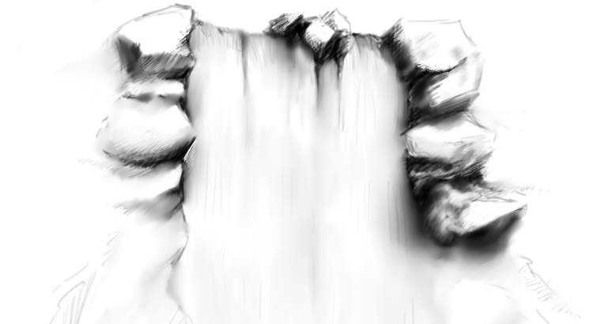
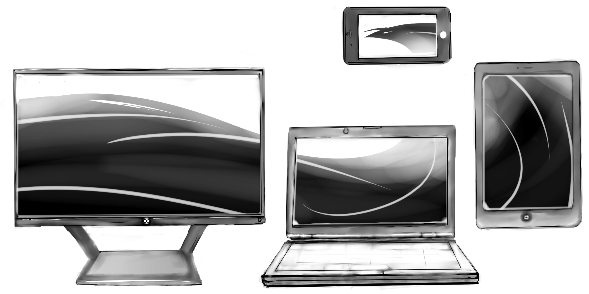

# Ebb & Flow
## Work in progress

- [Draft](#draft)
- [Author](#author)
- [Read-Full-Article](#article)

- - - 

# Draft

                                               A Dao of Web Design
                                                 
                                                     Summary

In John Allsopp’s article, A Dao of Web Design, John compares designing a website to Taoism. He talks about how the internet is a new medium that's still in it’s early stages of development and needs to be approached with an open mind. Throughout the article he quotes passages from the Dao that help define what is happening with the transition from traditional printing to web design.

  The inflexible habits and traditions of the printer that carries over to web page designing can cause a stiff or broken pages. When it comes to working with the internet, limitations arise that were never encounter in the printing side of media. Think of all of the people using phones or small devices to browse a single web page. All the varying resolutions and screen sizes could cause countless errors and overlapping, hard to read text or breaks in a graphic.

  John talks about how websites are stiff and sometimes broken because of the unwillingness to let go of print to paper traditions. Old habits die hard and although difficult to break, lead to adaptable and more importantly, accessible webpages. 	When it comes down to it, it’s accessibility you're after when designing a page. How many people on how many different platforms can view your content? 

  The article is dated 2000 and I feel this idea of flexibility in our webpages has been expanded upon, especially with the tablet and smartphone boom. This article serves as a great touchstone for understanding what kind of thinking is necessary for a young medium that requires so much awareness in a quickly morphing environment. Every day something new is being made that changes the internet slightly in different ways, and trying to keep up with it can be difficult. We must keep adapting, flowing, like water to the ocean. 

- - -
# Author

About the Author

Hey! My name is Chris, I'm a Montserrat stuident who is majoring in sculpture. I like videogames, programming, and sketching.

- - -

# Article

If you would like to read the full article, here it is!

[“A Dao of Web Design”](https://alistapart.com/article/dao)

 - - -
 
 # HTML & Summary
 
 
 - ["Index"](index.html)
 - ["Summary.HTML"](summaryfin.html)
 - ["Summary.MD"](summary.md)

